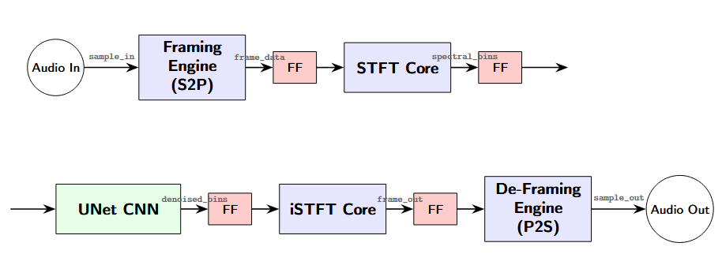
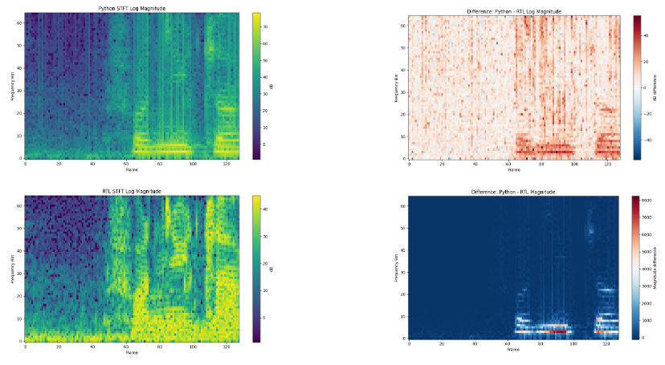
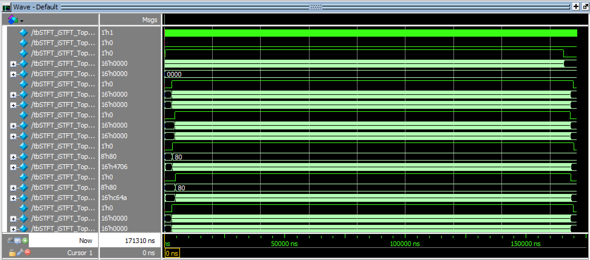

# Electrical Engineering Project Portfolio  

This repository highlights selected hands-on projects I have built or contributed to as part of my coursework and independent exploration in **electrical engineering, embedded systems, and hardware design**. Each project folder contains a more detailed README with design notes, code explanations, and implementation details.  

# Projects  

## FPGA Speech Enhancement Accelerator

A collaborative FPGA project implementing a **real-time speech enhancement pipeline** for hearing-aid applications. Audio is transformed into the frequency domain using an STFT, processed by a quantized CNN for denoising, and reconstructed using an inverse STFT. The design targets **low-latency, low-power** operation on FPGA hardware.

## Overview

- **Core idea:** Implement a real-time speech enhancement pipeline using FPGA acceleration and a quantized CNN.
- **Target platform:** Terasic DE2-115 FPGA
- **Performance:** Processed 1.03 s audio segments in 171 µs at 50 MHz in RTL simulation/synthesis benchmarking (>6000× real-time throughput).
- **Team project:** Developed collaboratively with one teammate.
[Project Folder](./STFTCNNVoiceEnhancement)
### My Contributions

- Designed and implemented the RTL for the spectral processing pipeline, including:
  - STFT
  - Magnitude/phase conversion
  - Log normalization
  - Quantization
  - Inverse STFT
- Built a Python/NumPy golden-model verification framework to compare RTL outputs against floating-point reference implementations.
- Developed automated benchmarking and error-analysis scripts using element-wise comparisons and RMSE metrics.
- Performed synthesis, timing analysis, and power analysis to evaluate FPGA performance and resource utilization.

### Collaborative Components

- CNN architecture and training
- CNN hardware implementation
- End-to-end system integration
- Documentation and project planning

### Skills Demonstrated

- FPGA Design (Verilog/SystemVerilog)
- Digital Signal Processing
- RTL Verification
- Hardware/Software Co-Design
- Fixed-Point Arithmetic
- Performance Optimization
- Git Collaboration
- Python/SciPy (for golden-model verification)

## Project Gallery
The figures below show the system architecture, STFT verification, RTL simulation, and FPGA resource/power utilization.
### System Architecture

### STFT Verification

### RTL Simulation

### STFT FPGA Resource Utilization
[Utilization](./STFTCNNVoiceEnhancement/STFTPipeline-Flow-Summary.rpt)
[Power Utilization](./STFTCNNVoiceEnhancement/STFTPipeline-Power-Summary.rpt)

### 2. Useless Box with Personality  
A playful mechanical/electrical project that uses **PWM motor control** and **limit switches** to create a box that “fights back” when interacted with.  
- **Core idea:** A switch on the outside of the box is flipped on; the box opens, and a mechanical arm flips the switch off.  
- **Unique feature:** The box is programmed with distinct “personalities,” such as rushing forward to flip the switch quickly and then slowly retreating.  
- **Skills demonstrated:**  
  - PWM for motor speed control  
  - Mechanical switch debouncing and control logic  
  - Integration of hardware + software for interactive design  

[Useless Box](./useless_box)  

### 3. LED Matrix Audio Visualizer  
An embedded systems project that processes real-time microphone input and displays sound levels on an LED matrix.  
- **Core idea:** Microphone signals are filtered and mapped to visual bar patterns on the matrix.  
- **Hardware used:** ESP32 microcontroller, shift registers, microphone input module, LED matrix.  
- **Skills demonstrated:**  
  - Signal sampling and filtering  
  - Driving LED matrices with shift registers  
  - Embedded C++ programming on ESP32  

[LED Matrix](./ledmatrix)  

## Technical Skills Highlighted  
- Embedded systems: ESP32, Arduino, shift registers  
- Programming: C/C++ for microcontrollers  
- Hardware: Sensors, actuators, soldering, circuit design  
- Control techniques: PWM, signal processing  

### About This Portfolio  
This repository is intended to showcase hands-on engineering work I've completed outside of the classroom. 
